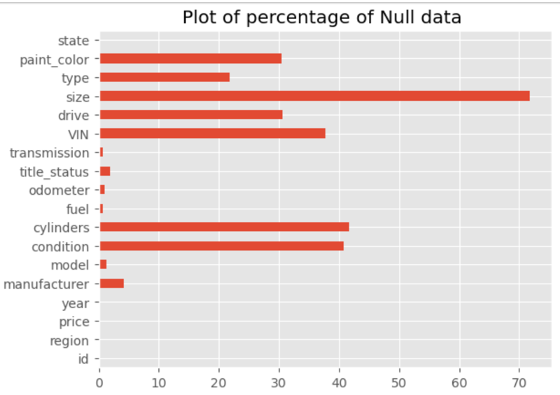
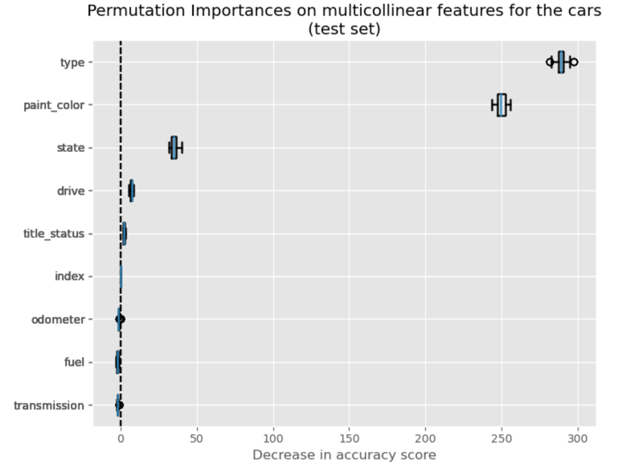
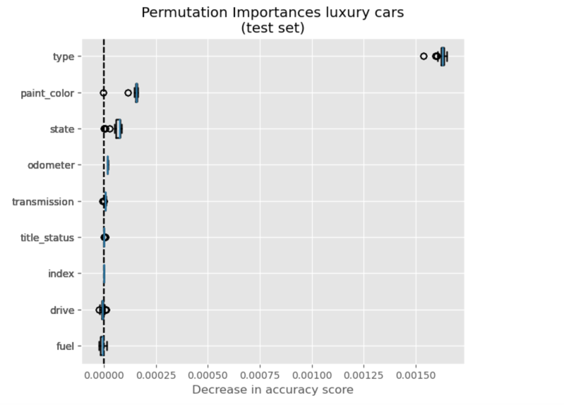

# Berkeley ML/AI Modeling Car prices for Used Cars - Case Study

### Objective

The purpose of this case study is to find out the used car prices by utilizing the CRISP-DM framework.
A set of steps are going to be executed in accordance with the framework initially starting with the data unde100pxrstanding, data cleansing, genrating model, evaluating and then deploying the model.
The used car businesses face the challenge of establishing a robust predictive model for determining used car prices. The aim of this project is to accurately estimate the used car prices model which could be utilized by the businesses. The model will enable a transparent and data driven approach to aid to both the business and the consumer, enhancing customer satisfaction and facilitating smoother transactions.

### Data Understanding
In order to have a better understanding of data, some of the key components of the data, like the number of rows and features(or columns)
- Exploring the nature of each feature and how much percentage of data is present for each feature
- Building an understanding on how clean the data is and if it's relevant to the feature under discovery
- Understanding the relevance of the data in the row and how many permutations to keep or discard or roll up to a relevant bucket.

For example, the used cars data have
rows = 426880
columns = 18

Some of the key findings from data understanding were to find out:
1. A few columns have a large number of rows with null (or empty) data. (Image 1)
2. "Size" and "Type" are redundant columns which could be collated together to have more complete and comprehensive data.

</img>
(Image 1)

### Data Preparation

After the data exploration, data preparation to cleanse or delete the data was performed so that the model could be performant.
1. Unimportant columns and rows were dropped which had a little or nothing to add to the model generation
2. Columns like 'ID', 'VIN', 'Cylinders' were removed
3. Year data was made as an index
4. Several other data where the missing rows could be based of on other rows were forward filled(ffill) and backfilled(bfill)
5. Lot of features like "Transmission", "Fuel", "Odometer", "Title Status", "Drive" and "Paint color" were cleansed to reduce the degree of variability.

### Modeling 
For Modeling, three models were used 
1. Ridge
2. Lasso
3. Linear 
Upon comparison the models were very close and Linear was very slightly better, so choosing `the Linear model` was the best way to go for the final processing.

### Evaluation
Upon evaluation of the model it clearly seems that type, paint_color, odometer, transmission are important factors in determining the price
The Linear model very slightly seems to be doing the better than ridge
`Linear
Train: 7245.05
Test: 7244.83`

However, when compared to the mean price value
`Mean Price = 75305.64`
the model diffrential is much higher

The next set of re-evaluation were to remove the cars which are:
1. Luxury or collectibles and cost > $50K and
2. Cars which have low value (<1000) and rerun the analysis

## Conclusion
After model testing and evaluation, it seems like the models are very close however, based on this figure below the linear model is very slightly better than ridge. Using this model and generating the permutation importance for the feature yield that 
For Basic cars, these features are of utmost importance --

    type
    paint_color
    state   
    drive   
    title_status
</img>

When using the same model to generate the permutation importance for the Luxury cars, a slightly different set of features are important in determining the price of the car:

    type    
    paint_color
    state   
    odometer
    transmission

</img>

##### Next steps:
Even though the model has become good and close and is identifying the key features for getting better prices for the Used cars.
The next steps are to fine tune the model a bit more further by running the cross validation, like kfold or leave one out, so that it could be identified if the model is being under or over-trained and then fine-tuned to provide better results.
